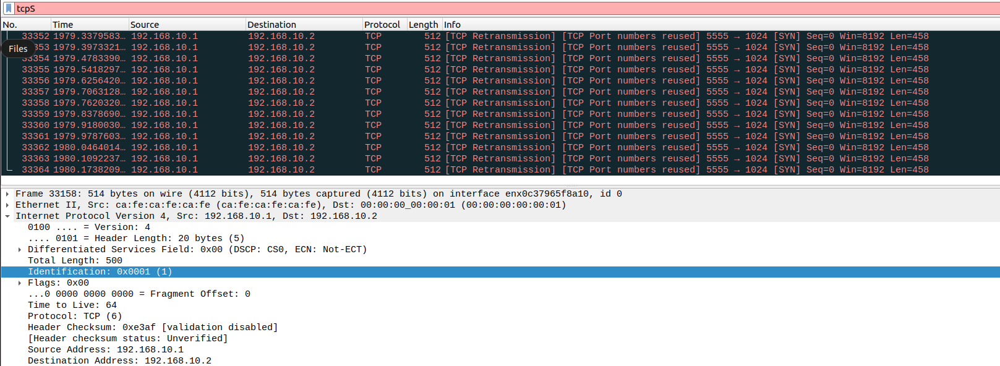

## Traffic Capture 
***Q: What type of traffic has been captured?***

**Figure 1: Departmental Computer Traffic**

The types of traffic are various including ARP, HTTP, TCP, etc.

***Q: How to capture http traffic?***

**Figure 2: Departmental Computer HTTP Traffic**

An http display filter with expression http had to be applied to shark.

***Q: Rasberry Pi Capture?***

**Figure 3: Rasberry Pi Traffic**

## Sending Traffic 

***Q: Can you define a filter to filter only the message you sent?***

We observe that the traffic sent to the Rasberry Pi is all in UDP format. So this can be accomplished defining a filter with expression 
$$ udp \&\& !(udp.port == 53)$$
, with the second subformula to filter out DNS traffic which is also UDP protocol with port = 53.

***Q: what is packet size and what format?***

**Figure 4: Sent Traffic Only**

This type is UDP format. We see that although in the script the number of word is 22, but due to the header of the UDP format, we have total packet size of 64 bytes.

***Q:Modify the Script?***

**Figure 5: Modified-script-traffic**

Note that in order to achieve 512byte size packet, we need to adjust the number of words so that after adding the header, the packet reaches the size requirement.