## Ping
***Q: Ping from the lab machine to the Raspberry Pi, 10 times, interval 0.2 seconds.***
The average time is around 0.46ms

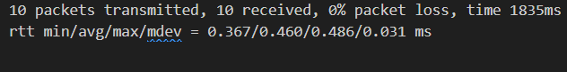

**Figure 1: Machine to Pi**

***Q: Ping from the Raspberry Pi to the lab machine, 10 times, interval 0.2 seconds.***
The average time is around 0.56ms.
We see that the time for the Rasberry Pi to send data to the lab machine takes more time as the Rasberry Pi is underperforming lab machine for sending data.

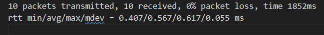

**Figure 2: Pi To Machine**

***Q: Ping from the Raspberry Pi to the lab machine, 100 times, interval 0.001 seconds (use sudo),and discuss the differences between minimum, mean and maximum results.*** 
The average time is 0.44ms. We see that the time has decreased. This is expected as with such a small interval, we are basically flooding the lab machine, and more CPU power is devoted to this task rather than computing other programs in the background.
The min is the case where of minimal cpu loading and minimal program queuing, compared to the maximal case where other programs occupy considerable portion of the cpu such that is doesn't have time to respond the task as fast. The mean is the expected time of responding with the cpu loading probability distribution.

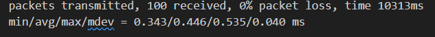

**Figure 3: Near Flooding**

***Q: Ping from the Raspberry Pi to the lab machine, 10000 times using flooding (use sudo).***

We see that the average is 0.435, slightly faster than the near flooding for the same reason near flooding was faster than 0.02s time interval.

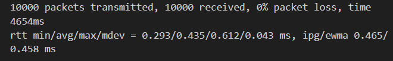

**Figure 4: Flooding**

***Q: Ping from the Raspberry Pi to the lab machine. Run measurements with 3 different intervals (0.01, 0.001, 0.0001) and at least 1000 measurements, and draw a cdf of your measurements results (one graph per interval)***

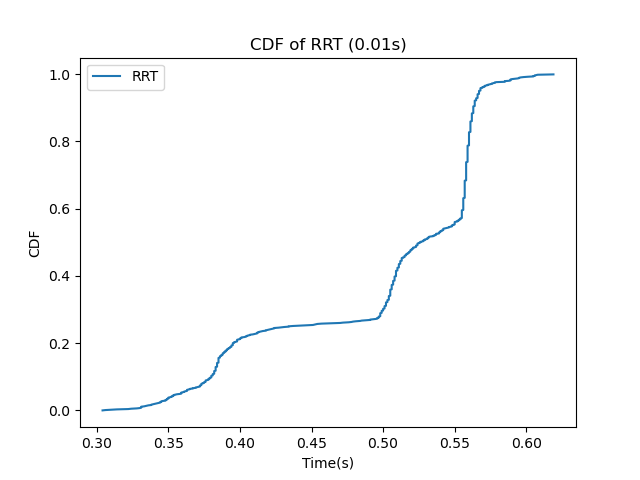

**Figure 5: 0.01 RRT CDF**

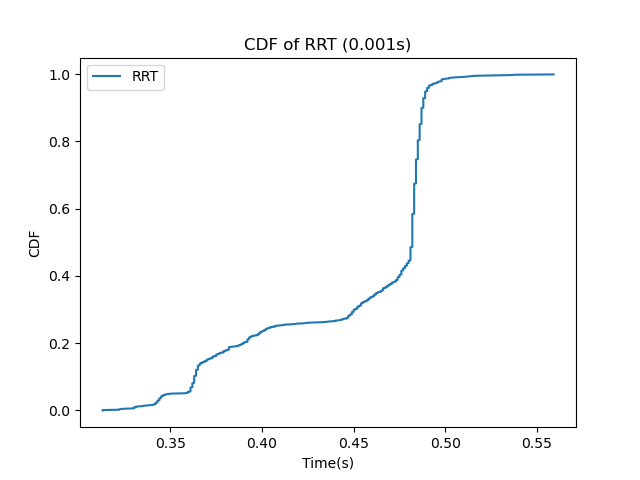

**Figure 6: 0.001 RRT CDF**

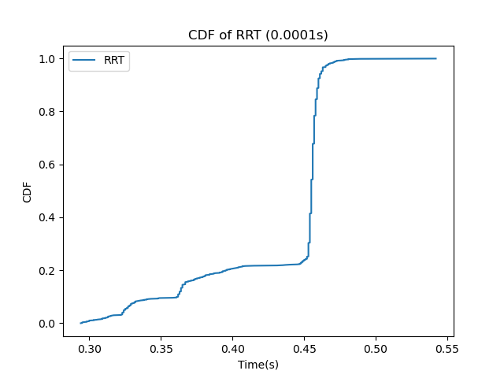

**Figure 7: 0.0001 RRT CDF**

We see that the graphs look very similar to each other. This is due to the clock period and the period of the internal program of the cpu, making the probabilistic distribution similar.

***Q:Can you speculate why different intervals lead to different round trip results? What do you estimate is the most accurate measured parameter (e.g., min, max, mean) that can be used to estimate propagation time between the two machines?***
The reason is mentioned above, due to increasing allocation of computational resources to the responding of CPU as time interval gets closer to flooding.

Under normal situations, the CPU never gets close to flooding, so the non-flooding parameters are good estimators.The parameters of 0.01s interval of min/avg/max/mdev = 0.304/0.500/0.619/0.075 ms are good estimates.

## Iperf

***Q: What is effective bandwidith of Pi(client) and machine(server)?***

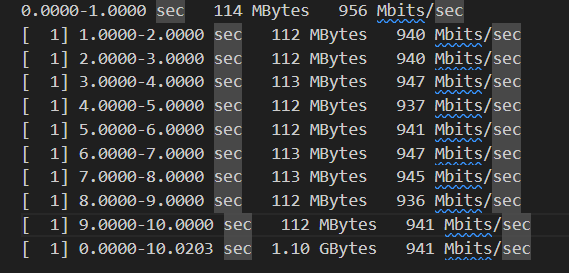

**Figure 8: Bandwidth of Lab Machine being Server**

We see that the bandwith is around 940Mbits/s

***Q: What about the other way around?***

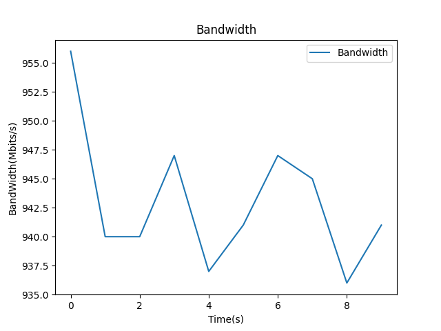

**Figure 9: Bandwidth of Rasberry Pi Server**

We see that the bandwidth is approximately the same as in the previous case due to symmetrical connection nature of the system.

***Q: What about for bidirectional Iperf?***

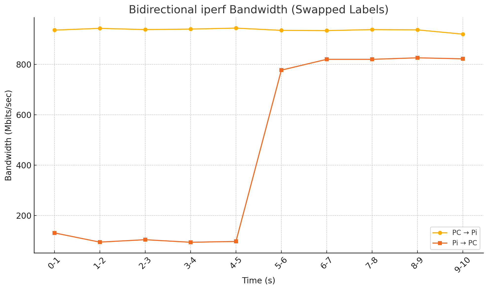

**Figure 9: Bidirectional Iperf**

We see that bidirectional iperf yields very different result. This is because of the traffic congestion and the limited CPU loading capacity of the rasberry Pi to be a send data and receive data at the same time,  but after 5s, the bandwidth goes up due to buffer adjustment within the pi.

***Q: Run one way iperf using UDP, from the lab machine to the Raspberry Pi, 5 sec long, with varying bandwidth (100Kb/s, 1Mb/s, 100Mb/s).***

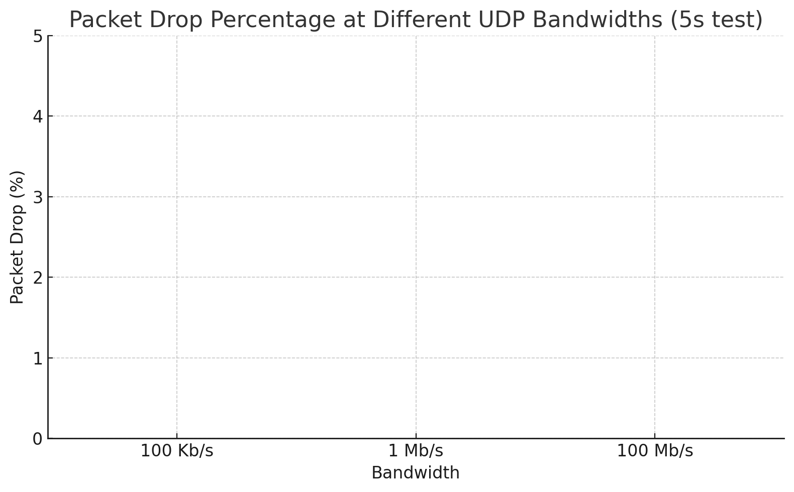

**Figure 10: 0 Loss**

Sadly there is no packet drop. This is due to packet drop does not include retransmission, and the nodes would keep requesting retransmission until all datagram is received.

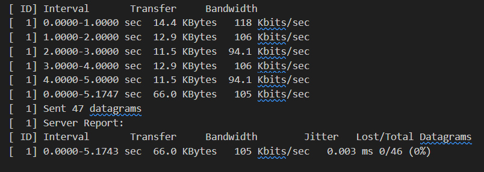
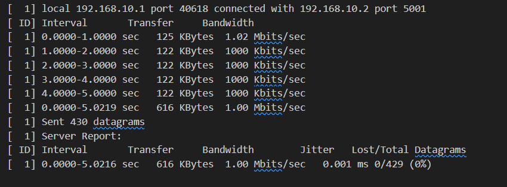
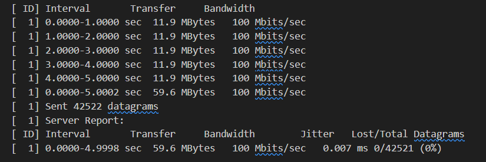

**Figure 11: 100k&1m&100m**

Not much to talk about, but notice that the fluctuation and jitter number for each cases, as we will be discussing these in iperf3.

# Iperf3

***Q: Plot of Iperf3 Bandwidth***

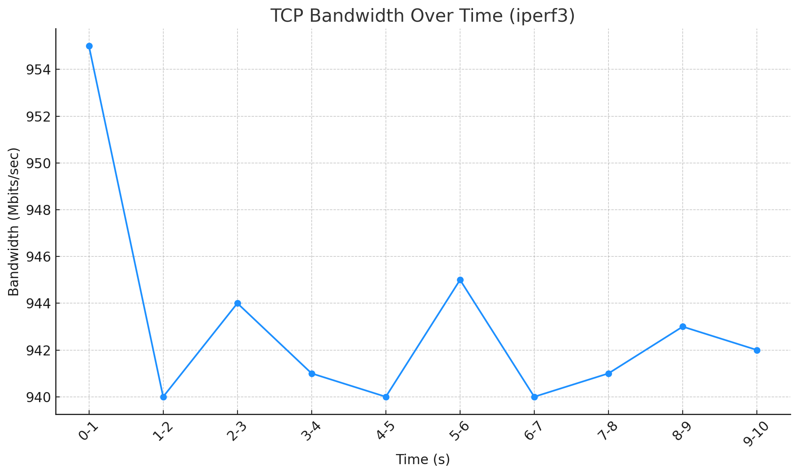

**Figure 12: Iperf3 Bandwidth**

We see that the result is similar to the iperf case.

***Q:Run one way iperf3 using UDP, from the lab machine to the Raspberry Pi, 5 sec long, with varying bandwidth (100Kb s, 1Mb/s, 100Mb/s).***

**Figure 13: 0 Loss**

We see that iperf3 also has 0 loss.

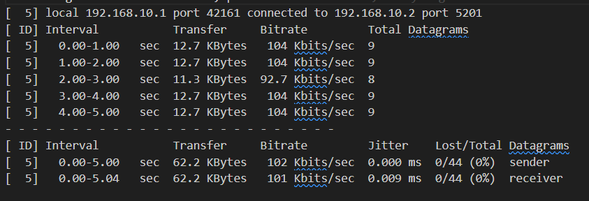
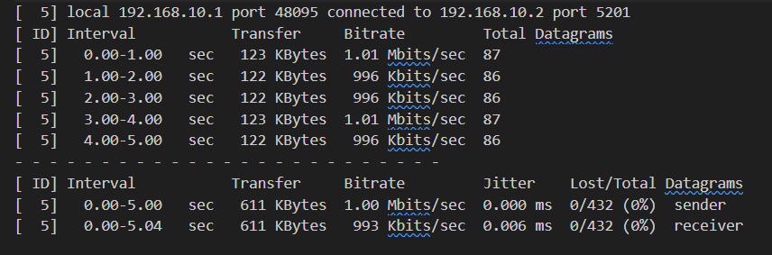
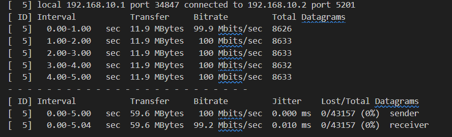

**Figure 14: 100k&1m&100m**

***Q:Discuss any observed differences between iperf and iperf3 results.***

We see that iperf3 has more jitter, which might be due to the fact that iperf3 is designed for single-core purpose, or that our data amount is just not sufficient to display actual jitter. Also iperf3 has more stable bandwidth(it's bandwidth fluctuation of 4k is smaller compared to the 8k fluctuation of iperf), which might also due to insufficient data.