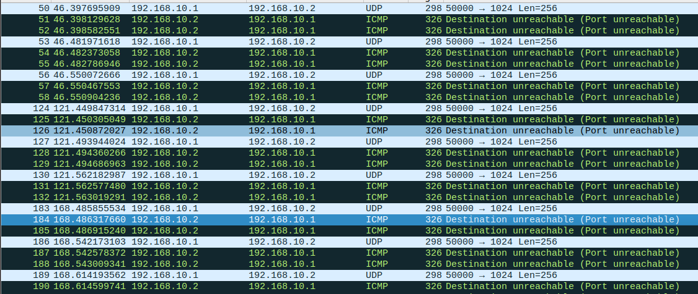
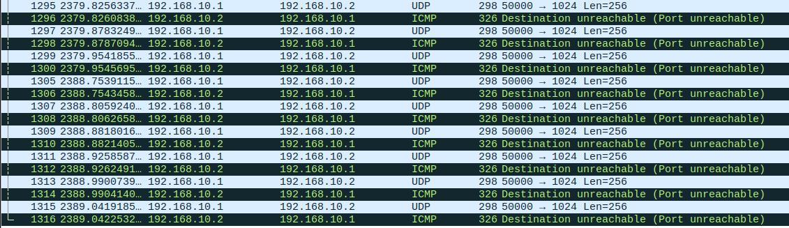
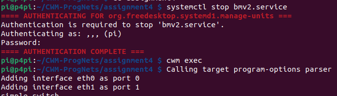
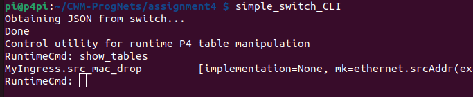

## Running P4 Program

***Q: Can you add table entries so the program will drop the packets you send?***
Yes. We can accomplish this by adding the mac address of the lab machine to the table of the reflector P4 program.

**Figure 1: Traffic Capture of Modified Reflector**

Notice that in the above traffic capture that for every UDP packet sent, we receive 2 ICMP error from the Rasberry Pi. One of the ICMP error is accounted for by the table dropping the packet, and the additional one is because we have set the send.py program with the lab machine's mac address and the Rasberry Pi's mac address, and this inflicts a systematic error within the Linux machine. If we had used completely random mac addresses, there would only be ICMP error message as shown in the below one.

**Figure 2: Traffic with Random Mac Address**

***Q: What is cwm command?***
The cwm command is a shell scripting script, and compose of the command to call reflector.p4. It is similar to any command in linux such cat or awk. chmod u+x gives user the execution permission of cwm. I modified the directory inside the command and the name of the file to call the correct reflector.p4 file, and the effect is the same as executing the commands given in the notes.

**Figure 3: Effect of Excuting cwm Command**

