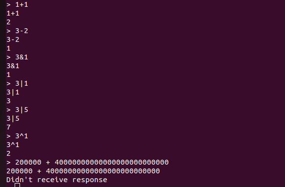

***Q: Run the calc.py script, do you get correct results?***

**Figure 1: Response without correct Address**

Sadly no as we haven't corrected the addresses inside the script.

**Figure 2: Response with correct Address**

This time communication has been established, but as we haven't wrote the P4 code, the system doesn't receive response.

***Q: Does the calculator work?***

**Figure 3: calculator values**

After implementing the P4 code, the calculator successfully perform + - & | ^ operations. We note that as the bit<32> is unsigned, thus the P4 doesn't not support negative number and overflow would occur for subtraction. Also, as we only have 32 bits to express integers, for values with more than 32 bits, the p4 program cannot fit it into the header format and we get no responses.