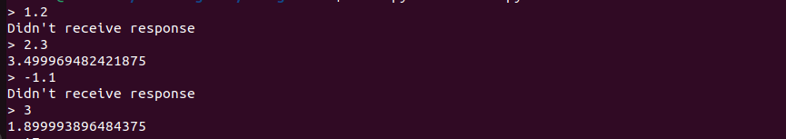
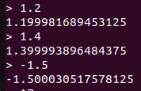

# Mini Project - Gradient Aggregator

The idea is to implement a gradient aggregator that would continuously accumulate the partial gradients from all the workers until all workers have forwarded their partial gradients at which the P4 forwards the gradient sum to the server(the lab machine).
Also, I implemented a broadcasting action that would broadcast the gradient from the server back to the workers.
The assumed number of workers is 2, and the number of gradients is 1. We could extend these to multiple gradients and more workers  by replicating part of the code continuously (since P4 doesn't support loop).

The challenge of gradient aggregator was to implement float and negative values in p4. This is accomplished with 2's complement and Q 16 16 (15 bits for integer and 16 bits for float point).

A major problem came across was that parsing was incorrect (and forgot to set the check for valid parser during deparsing), leading to the gradient aggregator accepting junk packets as the gradient and changing the sum value and counter inside the p4.

It was surprising to find that the registers in P4 are automatically initialized to 0 without any explicit initialization. 

Results:

**Figure 1: Gradient Accumulation**

We can see that we only see a return message after two packets have been forwarded.

**Figure 2: Broadcasting**

We see that the P4 successfully broadcasts the current gradient to the worker (in the above cases, the worker and the server are both the lab machine for simplicity).

Further implementations would include mirroring and recycling so that the server only needs to send one packet in order to broadcast to all workers instead of needing to forward to all workers.